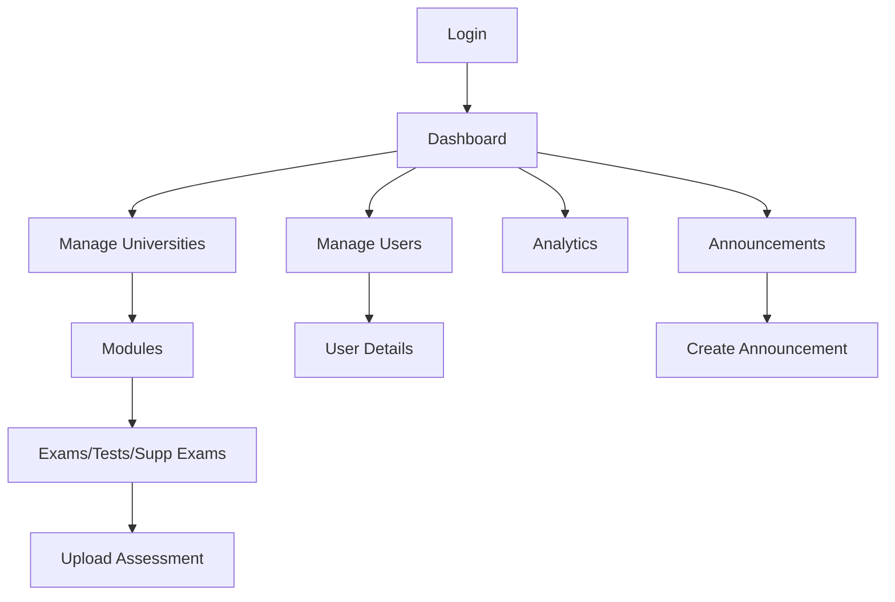

## 1. Product Overview
StudentMATE Admin Panel is a web-based management system for educational content administrators. It enables efficient management of universities, modules, and assessments (exams/tests/supplementary exams) that students access through the mobile app.

The admin panel serves as the central control hub for content creators to upload and organize academic materials, manage user access, and monitor system analytics.

## 2. Core Features

### 2.1 User Roles
| Role | Registration Method | Core Permissions |
|------|---------------------|------------------|
| Super Admin | Manual creation by system | Full access to all universities, modules, assessments, users, and system settings |
| University Admin | Invitation by super admin | Manage specific university modules, assessments, and view related analytics |

### 2.2 Feature Module
Our admin panel requirements consist of the following main pages:
1. **Dashboard**: Statistics overview, recent exams, pending requests, recent activity
2. **Manage Universities**: Add/edit universities with logos and codes
3. **Modules**: Add/edit modules per university with course codes and names
4. **Exams**: Upload and manage exam PDFs with metadata (year, title, module)
5. **Tests**: Upload and manage test PDFs with metadata
6. **Supplementary Exams**: Upload and manage supplementary exam PDFs
7. **Manage Users**: View user details, points balance, subscription status
8. **Analytics**: View usage statistics and engagement metrics
9. **Announcements**: Create and manage system announcements

### 2.3 Page Details
| Page Name | Module Name | Feature description |
|-----------|-------------|---------------------|
| Dashboard | Statistics Cards | Display total exams, tests, supplementary exams, and pending requests with real-time counts |
| Dashboard | Recent Exams Table | Show latest uploaded exams with module, title, university, date, and creator information |
| Dashboard | Pending Requests | Display user upload requests with approve/deny actions |
| Dashboard | Recent Activity | Show chronological log of admin actions and user registrations |
| Manage Universities | University List | Display all universities with edit/delete actions |
| Manage Universities | Add University Form | Input fields for name, code, and logo upload with validation |
| Modules | Module List | Show modules filtered by selected university with edit/delete actions |
| Modules | Add Module Form | Input fields for module code, name, and university selection |
| Exams/Tests/Supp Exams | Assessment List | Display assessments filtered by university and module with preview/download |
| Exams/Tests/Supp Exams | Upload Assessment | Form with university/module selection, year, title, type, and PDF upload |
| Manage Users | User List | Display users with search, filter by university, view details |
| Analytics | Usage Charts | Show assessment downloads, user engagement, and revenue metrics |
| Announcements | Announcement List | Manage active/inactive announcements with edit/delete |
| Announcements | Create Announcement | Form for title, message, university targeting, and active status |

## 3. Core Process

### Admin Flow
1. Login to admin panel using Firebase authentication
2. Navigate to "Manage Universities" to add new universities with logos
3. Select a university and navigate to "Modules" to add course modules
4. Go to "Exams", "Tests", or "Supplementary Exams" to upload PDF assessments
5. Select university → select module → fill assessment details → upload PDF
6. Monitor dashboard for pending user requests and approve/deny them
7. Create announcements targeted to specific universities
8. View analytics to track system usage and engagement

### Page Navigation Flow

## 4. User Interface Design

### 4.1 Design Style
- **Primary Colors**: Blue gradient (#2563eb to #1d4ed8) for sidebar and primary actions
- **Secondary Colors**: Green (#10b981) for success/approve actions, Red (#ef4444) for deny/delete
- **Background**: Light gray (#f9fafb) for main content area, white for cards
- **Button Style**: Rounded pills with hover effects, primary buttons filled, secondary outlined
- **Font**: Sans-serif system fonts, headings bold (600), body text regular (400)
- **Layout**: Fixed sidebar navigation, card-based content sections with subtle shadows
- **Icons**: Line icons for navigation, file icons for documents, badge icons for stats

### 4.2 Page Design Overview
| Page Name | Module Name | UI Elements |
|-----------|-------------|-------------|
| Dashboard | Statistics Cards | 4 rounded cards with icons, large numbers, percentage badges, color-coded by type |
| Dashboard | Recent Exams Table | White card with green "+ Add Exam" button, striped rows, timestamp badges |
| Dashboard | Pending Requests | White card with approve/deny outline buttons, email display in gray |
| Sidebar Navigation | Menu Items | Dark blue gradient background, white icons, selected item highlighted with light blue pill |
| Header | Top Bar | Light background, search bar with magnifying glass, admin avatar with dropdown |

### 4.3 Responsiveness
Desktop-first design with mobile-adaptive layout. Sidebar collapses to hamburger menu on mobile, cards stack vertically, tables become scrollable horizontally.

### 4.4 3D Scene Guidance
Not applicable - this is a 2D web admin panel.