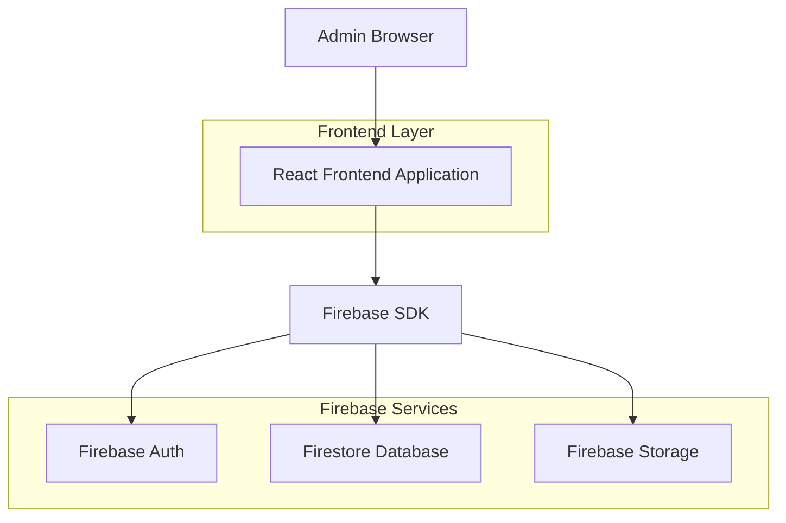
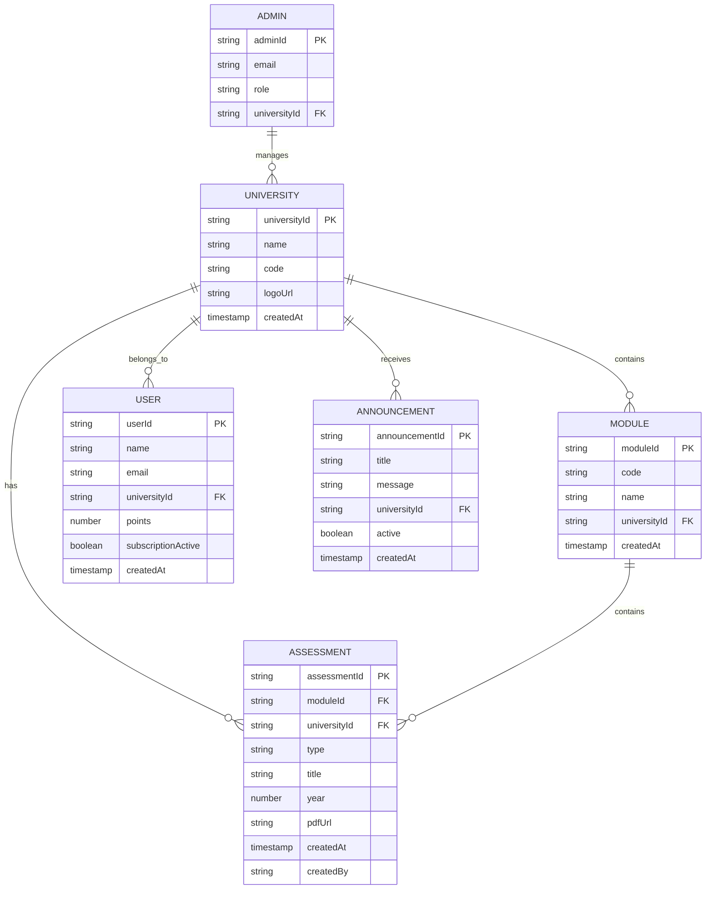

## 1. Architecture Design



## 2. Technology Description

- **Frontend**: React@18 + tailwindcss@3 + vite
- **Initialization Tool**: vite-init
- **Backend**: Firebase (Firestore, Auth, Storage)
- **State Management**: React Context API + useState/useEffect
- **Routing**: React Router DOM
- **UI Components**: Custom components with Tailwind CSS
- **File Upload**: Firebase Storage SDK
- **Authentication**: Firebase Auth with email/password

## 3. Route Definitions

| Route | Purpose |
|-------|---------|
| /login | Admin authentication page |
| /dashboard | Main dashboard with statistics and overview |
| /universities | Manage universities (add/edit/delete) |
| /modules | Manage modules per university |
| /exams | Manage exam assessments |
| /tests | Manage test assessments |
| /supplementary-exams | Manage supplementary exam assessments |
| /users | View and manage registered users |
| /analytics | View system usage statistics |
| /announcements | Create and manage announcements |

## 4. API Definitions

### 4.1 Firebase Collections Structure

**Universities Collection**
```typescript
interface University {
  universityId: string;
  name: string;
  code: string;
  logoUrl: string;
  createdAt: Timestamp;
}
```

**Modules Collection**
```typescript
interface Module {
  moduleId: string;
  code: string;
  name: string;
  universityId: string;
  createdAt: Timestamp;
}
```

**Assessments Collection**
```typescript
interface Assessment {
  assessmentId: string;
  moduleId: string;
  universityId: string;
  type: 'exam' | 'test' | 'supplementary';
  title: string;
  year: number;
  pdfUrl: string;
  createdAt: Timestamp;
  createdBy: string;
}
```

**Users Collection**
```typescript
interface User {
  userId: string;
  name: string;
  email: string;
  universityId: string;
  points: number;
  subscriptionActive: boolean;
  createdAt: Timestamp;
}
```

**Announcements Collection**
```typescript
interface Announcement {
  announcementId: string;
  title: string;
  message: string;
  universityId: string;
  active: boolean;
  createdAt: Timestamp;
}
```

**Admins Collection**
```typescript
interface Admin {
  adminId: string;
  email: string;
  role: 'superadmin' | 'university_admin';
  universityId?: string;
}
```

### 4.2 Firebase Operations

**Create University**
```typescript
const createUniversity = async (data: {
  name: string;
  code: string;
  logoFile: File;
}) => {
  // Upload logo to Firebase Storage
  // Create university document in Firestore
}
```

**Upload Assessment**
```typescript
const uploadAssessment = async (data: {
  universityId: string;
  moduleId: string;
  type: 'exam' | 'test' | 'supplementary';
  title: string;
  year: number;
  pdfFile: File;
}) => {
  // Upload PDF to Firebase Storage
  // Create assessment document in Firestore
}
```

**Get Dashboard Statistics**
```typescript
const getDashboardStats = async () => {
  // Count total exams, tests, supplementary exams
  // Count pending requests
  // Return aggregated data
}
```

## 5. Server Architecture Diagram

Not applicable - Firebase provides backend-as-a-service functionality.

## 6. Data Model

### 6.1 Data Model Definition



### 6.2 Firebase Security Rules

**Firestore Security Rules**
```javascript
// Admin authentication check
function isAdmin() {
  return request.auth != null && 
    exists(/databases/$(database)/documents/admins/$(request.auth.uid));
}

// University admin can only access their university
function isUniversityAdmin(universityId) {
  return isAdmin() && 
    get(/databases/$(database)/documents/admins/$(request.auth.uid)).data.role == 'superadmin' ||
    (get(/databases/$(database)/documents/admins/$(request.auth.uid)).data.role == 'university_admin' &&
     get(/databases/$(database)/documents/admins/$(request.auth.uid)).data.universityId == universityId);
}

// Apply rules to collections
match /universities/{universityId} {
  allow read: if isAdmin();
  allow write: if isUniversityAdmin(universityId);
}

match /assessments/{assessmentId} {
  allow read: if isAdmin();
  allow write: if isUniversityAdmin(resource.data.universityId);
}
```

**Storage Security Rules**
```javascript
// Only authenticated admins can upload files
match /assessments/{allPaths=**} {
  allow read, write: if request.auth != null && 
    exists(/databases/$(database)/documents/admins/$(request.auth.uid));
}

match /university-logos/{allPaths=**} {
  allow read: if true;
  allow write: if request.auth != null && 
    exists(/databases/$(database)/documents/admins/$(request.auth.uid));
}
```